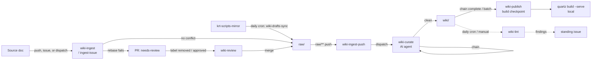

# Architecture

A general-purpose, domain-agnostic knowledge wiki. Source documents are ingested
into `raw/` — by direct push, a GitHub issue labeled `wiki-ingest`, or remote
dispatch — an AI agent curates them into an interlinked wiki under `wiki/`, and
the result is published as a static site.

The operating contract for the AI agent (page conventions, ingest/query/lint
workflows, frontmatter, linking rules) lives in [CLAUDE.md](../CLAUDE.md). This
document describes the system that surrounds it.

---

## The two-layer model

```
raw/            immutable source documents (the inputs)
   │
   ▼   curation (AI agent, per CLAUDE.md)
wiki/           interlinked knowledge pages (the derived layer)
   │
   ▼   build (Quartz)
local site      static HTML, served on demand with `quartz build --serve`
```

- **`raw/`** is append-only source of truth. Files are never modified in place.
  Text sources land directly; binary sources (PDF, DOCX, PPTX, XLSX, HTML) are
  converted to Markdown first. Binary assets live under `raw/assets/`.
- **`wiki/`** is fully owned by the AI agent. It contains one summary page per
  source (`wiki/sources/`), plus `wiki/entities/` and `wiki/concepts/` pages,
  a catalog (`index.md`), an append-only `log.md`, and an evolving `overview.md`.
- **Publishing** renders `wiki/` with [Quartz](https://quartz.jzhao.xyz/). There
  is no hosted deploy — `wiki-publish.yml` only builds the site as a validation
  checkpoint in CI. View the site by running Quartz locally
  (`npx quartz build --serve`). No cloud storage or hosting account is required
  anywhere in this pipeline.

---

## Repository layout

| Path | Purpose |
|---|---|
| `raw/` | Immutable source documents. Optional topical subfolders. Never edited. |
| `raw/assets/` | Binary assets (images, HTML) referenced by raw sources. |
| `wiki/` | Curated wiki pages (owned by the AI agent). |
| `wiki/index.md` | Content catalog, updated on every ingest. |
| `wiki/log.md` | Append-only operation log. |
| `wiki/overview.md` | Evolving high-level synthesis. |
| `wiki/sources/`, `wiki/entities/`, `wiki/concepts/` | Wiki page collections. |
| `wiki/assets/raw/` | Assets served to the site; mirrors `raw/assets/`. |
| `CLAUDE.md` | The AI agent's operating contract. |
| `docs/architecture.md` | This document. |
| `scripts/` | Dev/CI helpers (`setup-dev.sh`, `sync-wiki.sh`). |
| `.github/workflows/` | CI/CD automation (see below). |
| `.claude/` | AI agent config (`settings.json`) and skills. |
| `quartz/`, `quartz.config.yaml` | Static-site generator and its config. |
| `import/` | Ephemeral binary staging (gitignored). |
| `ingest-manifest.jsonl` | Append-only record of binary conversions. |

---

## Pipeline

The pipeline is event-driven through Git and GitHub Actions. Two Git trailers
track lineage so each stage knows what is stale:

- `X-Wiki-Workflow: ingest | curate | reset`
- `X-Raw-Source: <path to the raw file>`

### 1. Ingest → `raw/`

New source documents arrive in `raw/`. Three entry points:

- **Direct push** — commit Markdown (and its assets) to `raw/` with the ingest
  trailers. The `wiki-raw-push` skill automates this.
- **`wiki-ingest-issue.yml`** — open a GitHub issue labeled `wiki-ingest` with
  either a single dragged-in file attachment or Markdown pasted directly into
  the issue body. No external storage account needed — GitHub hosts the
  attachment itself. An optional `path/<subfolder>` label organizes the file
  as `raw/<subfolder>/…`. The workflow comments the result on the issue and
  closes it on success.
- **`wiki-ingest.yml`** — a `repository_dispatch` (event type `wiki-ingest`)
  stages a file from any fetchable URL (a presigned/SAS URL from any storage
  provider works — S3, GCS, self-hosted MinIO, etc.), routing text straight to
  `raw/` and converting binaries to Markdown via the `binary-transform` skill
  first. An optional `subpath` organizes the file as `raw/<subpath>/…`.
- On a merge conflict, ingest opens a PR tagged `needs-review`. `wiki-review.yml`
  re-lints the wiki diff with the AI agent when the label is removed (or the PR
  is approved) and auto-merges if clean.

### 2. Curate → `wiki/`

- A push to `raw/**` triggers `wiki-ingest-push.yml`, which finds the first
  stale raw file and dispatches `wiki-curate.yml`.
- `wiki-curate.yml` runs the AI agent against the stale file following the
  INGEST workflow in `CLAUDE.md`, commits the resulting `wiki/` changes, then
  self-re-triggers until the backlog is clear. A safety-net cron also runs
  (gated by the `WIKI_CURATE_CRON_ENABLED` repo variable).

### 3. Publish → local static site

- When the curate chain completes (or a batch threshold is crossed),
  `wiki-publish.yml` builds Quartz as a validation checkpoint and tags the
  commit `wiki-publish/<timestamp>`. There is no hosted deploy — pull `main`
  and run `npx quartz build --serve` to browse the site locally.

### Reset

- `wiki-reset.yml` (guarded by `confirm=yes-reset`) wipes `wiki/` pages back to
  stubs, drops `wiki-publish/*` tags, writes a reset marker, and restarts the
  curate chain so every raw file is re-curated from scratch.



---

## Search index (qmd)

The wiki is indexed with [qmd](https://www.npmjs.com/package/@tobilu/qmd) into a
SQLite database (`wiki.sqlite`), built locally only — via
`scripts/setup-dev.sh` on a developer machine, or by the AI agent as needed.
CI (`wiki-curate.yml`) rebuilds the index after each merge purely as a
validation check (to catch indexing errors early); it does not upload or
distribute the index anywhere. The AI agent queries the local index via the
`qmd` MCP server configured in `.mcp.json`.

---

## Skills

`.claude/skills/` holds vendored capabilities the AI agent invokes during
ingest and conversion:

- `binary-transform` — convert a binary in `import/` to Markdown in `raw/`.
- `pdf`, `pptx`, `docx`, `xlsx` — format-specific extraction used by the above.
- `wiki-raw-push` — commit new `raw/` sources with the correct Git trailers.

See `.claude/skills/VENDORED.md` for provenance.

---

## Toolchain sync

`scripts/sync-wiki.sh` (invoked by `wiki-sync.yml`, manual dispatch only)
propagates non-domain artifacts — `.github/`, `.claude/`, `docs/`, `quartz/`,
`scripts/`, and root config files — from a source checkout to instance repos via
a pull request. Domain data (`raw/`, `wiki/`, `ingest-manifest.jsonl`) is never
synced.

---

## Configuration reference

| Repo variable | Effect |
|---|---|
| `WIKI_CURATE_CRON_ENABLED` | Enable the every-4-hours curate safety-net cron. |
| `WIKI_CURATE_BATCH_SIZE` | Curations to accumulate before the next build checkpoint (default 5). |
| `WIKI_PUBLISH_ENABLED` | Allow the curate chain to dispatch the build-validation checkpoint. |

| Secret | Used for |
|---|---|
| `WIKI_PAT` | Cross-workflow Git operations and PRs. |
| `ANTHROPIC_API_KEY` | The AI agent in ingest/curate/review. |
